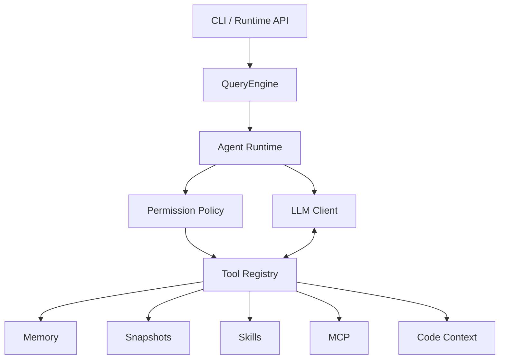

# Axiom Agent Runtime

[](https://github.com/ZhangYiFan2003/axiom-agent/actions/workflows/ci.yml)

A modular Python runtime and CLI for building tool-using AI agents.

Axiom Agent Runtime provides a small but complete foundation for experimenting with terminal agents: a CLI, one-shot prompts, a ReAct loop, tool execution, memory, snapshots, skills, MCP integration, Plan-and-Execute, multi-agent orchestration, graph-aware code context assembly, and a lightweight Runtime API. The current baseline is designed to be testable without real model calls, external MCP servers, secrets, or user-directory writes.

## Overview

Axiom is organized around a few core paths:

- `axiom` CLI for help, diagnostics, one-shot prompts, REPL entry, MCP helpers, and Runtime API startup.
- `QueryEngine` as the main facade for ReAct, plan execution, and multi-agent flows.
- OpenAI-compatible LLM client abstraction for real provider calls when configured.
- Tool registry and executor for model-requested local tool calls.
- AST code index, hybrid retrieval, symbol graph, and graph-aware context builder for repository understanding.
- Layered memory foundation, snapshots, skills, MCP, and Runtime API modules for runtime state and integrations.
- An RL-ready extension that converts durable Runs into validated trajectories and deterministic
  reward for external trainers; Axiom remains primarily an Agent Runtime.

The core Agent Runtime paths are covered by offline tests with fake LLM clients. Runtime API localhost lifecycle is covered with live HTTP tests. Some integration surfaces, such as MCP server transport lifecycle and public Runtime API deployment behavior, are intentionally marked as partially verified until they have stable end-to-end transport or deployment tests.

## Features

| Feature | Description | Verification |
| --- | --- | --- |
| CLI command | Typer-based `axiom` command with help, diagnostics, prompt mode, MCP helpers, and Runtime API commands. | Tested |
| One-shot prompt | Runs a single prompt through the configured provider and renderer. | Manual smoke tested |
| ReAct Agent | Executes the loop from model response to tool call, observation, and final answer. | Tested |
| Tool Calling | Merges streamed tool-call deltas, executes registered tools, and replays tool results to the model. | Tested |
| Built-in Tools | Includes file, shell, search, memory, skill, web, AST lexical/vector code search, static symbol/reference lookup, high-confidence static call graph queries, and snapshot tools. | Partially tested |
| Graph-Aware Code Context | Assembles search seeds, symbol definitions, references, callers, callees, and bounded call paths into budgeted agent context with reasons. | Tested |
| Memory | Stores typed conversation, summary, fact/preference, and tool-result digest records with scoped SQLite persistence, Runtime thread history recovery, Map-Reduce summary checkpoints, conservative fact/preference extraction, conflict supersession, and budgeted context assembly. | Tested |
| Live Context Management | Estimates every model request, preserves pinned task/tool state, incrementally compacts eligible old context with the existing map/reduce summarizer, projects oversized historical tool results, and fails locally at a hard input limit without deleting durable history. | Tested |
| Snapshots | Creates, restores, lists, and cleans workspace snapshots under an isolated home in tests. | Tested |
| Skills | Loads built-in, user, and project `SKILL.md` files and supports skill context injection. | Tested |
| Plan-Execute | Runs versioned DAGs as bounded parallel durable React Child Runs, with stable identity, dependency joins, CAS-safe observation, approval, isolation, recovery, and replan barriers. | Sequential/parallel compatibility and SQLite recovery tested |
| Multi-Agent | Runs bounded parallel durable React Child Runs with stable identity, dependency scheduling, approval/recovery, linked traces, and serialized reviewer transitions. | Runtime convergence and parallel recovery tested |
| MCP Client | Discovers and calls tools from local stdio MCP servers in tests. | Tested |
| MCP Server | Exposes built-in tools through handler-level JSON-RPC requests. | Handler tested |
| Runtime API | Provides threads, turns, resumable Runs, Memory/SQLite checkpoints, interrupt/resume/cancel, durable tool records, task CRUD, and stored SSE event replay. | Live localhost and crash recovery tested |
| Active Run Supervisor | Tracks the current process's durable Run Tasks across HTTP and production background-worker threads/event loops, supports durable-first cross-thread cancellation, Child propagation, safe inspection, and bounded shutdown drain. | Threaded multi-loop, worker, race, Child, subprocess, and shutdown paths tested |
| Observability | Persists Run traces and Agent/LLM/Tool/checkpoint/interrupt spans, including tokens, TTFT, latency, retries, and Run summaries. | SQLite reload, API, CLI, and crash continuity tested |
| Agent Evaluation | Runs JSON task datasets through the durable Runtime, applies deterministic scorers, writes JSON reports, and compares functional/performance regressions. | Runner, scorer, report, comparison, and CLI tested |
| Agentic RL Bridge | Converts durable Agent Runs into validated trajectories, decomposed deterministic reward, and trainer-facing rollouts. A real TRL GRPO/LoRA experiment completed verified model updates but did not improve held-out success (0/30 to 0/30). | Bridge smoke-tested; capability gain not achieved |
| Permission Policy | Evaluates capability, arguments, workspace scope, and Run context before Tool execution; supports durable per-invocation approval and policy audit spans. | Policy, restart approval, denial, audit, and Evaluation compatibility tested |
| Execution Isolation | Routes approved Shell calls through Local/Restricted backends with filtered environment, bounded output, timeout, and process-tree cleanup. This is not a complete OS sandbox. | Cross-platform backend, approval, restart, trace, and safety regression tests |
| Streaming | Parses OpenAI-compatible streaming events and renders incremental output. | Partially tested |
| REPL | Interactive prompt-toolkit entrypoint and slash commands. | Not fully verified |

## Architecture



Key modules:

- `src/axiom/entrypoints/cli.py`: CLI app, commands, prompt mode, diagnostics, MCP, and Runtime API commands.
- `src/axiom/entrypoints/repl.py`: interactive REPL and slash command handling.
- `src/axiom/config.py`: layered configuration loading.
- `src/axiom/llm/`: LLM protocol, provider factory, and OpenAI-compatible client.
- `src/axiom/agent/`: ReAct query loop, Plan-and-Execute, and multi-agent orchestration.
- `src/axiom/tools/`: tool model, registry, executor, and built-in tools.
- `src/axiom/rag/`: AST chunks, lexical/vector/hybrid search, symbol index, call graph, and graph-aware code context.
- `src/axiom/mcp/`: MCP client, MCP config, and MCP server handler support.
- `src/axiom/memory/`: scoped typed memory persistence, Runtime history recovery, and budgeted memory context assembly.
- `src/axiom/snapshot/`: workspace snapshot service.
- `src/axiom/runtime/`: local Runtime API, Run/checkpoint model, shared ReAct/Plan/Multi-Agent execution strategies, tool execution records, and durable task store.
- `src/axiom/runtime/supervisor.py`: process-local ExecutionHandle registry and cross-thread cancellation bridge; it is not a recovery database.
- `src/axiom/rl/`: trajectory construction, deterministic reward, rollout export, and the
  Agent Lightning v1 compatibility boundary. See [`docs/agentic-rl.md`](docs/agentic-rl.md).

### Durable execution

Axiom checkpoints execution state after durable boundaries and can resume interrupted runs after
process restart. The Runtime persists explicit JSON state rather than Python objects, with
`MemoryCheckpointStore` for tests/embedded use and `SQLiteCheckpointStore` for restart recovery.

Tool approval moves a Run to `WAITING_APPROVAL`; it can then be approved, rejected, cancelled, or
resumed after restart through `/v1/runs/{run_id}` endpoints. Runtime events and checkpoints have
separate roles: events are append-only history, while checkpoints are resumable state snapshots.

Successful tool calls are deduplicated with a stable `invocation_id`, argument hash, and persisted
ToolExecution result. Runtime-level deduplication does not magically provide exactly-once semantics
for arbitrary external side effects. Tools with external idempotency support can declare an
idempotency-key parameter; Axiom passes the invocation ID through, but the tool/external service
must enforce it.

See [`docs/durable-execution.md`](docs/durable-execution.md) for state transitions, API endpoints,
crash-window behavior, serialization boundaries, and current limitations.

The `/v1` control plane exposes stable Run representations, parent/child discovery, aggregated
pending interrupts, restart-safe idempotent resume/approval/cancel operations, structured conflict
errors, and hierarchical SSE replay. See [`docs/runtime-api.md`](docs/runtime-api.md).

Active durable executions in the current process are registered by Run ID with their owner
thread, event loop, and `asyncio.Task`. Cancel commits durable state before signalling the owner
loop, and shutdown performs bounded cancellation/drain. Waiting Runs and abandoned `RUNNING`
checkpoints may have no active handle. See
[`docs/active-run-supervisor.md`](docs/active-run-supervisor.md).

### Run observability

The durable Runtime writes a single trace per Run with hierarchical Agent, LLM, Tool, checkpoint,
interrupt, and resume spans. Query summaries with `axiom runs show <run_id>` and inspect the span
tree with `axiom runs trace <run_id>`. The same data is available through
`GET /v1/runs/{run_id}/metrics` and `GET /v1/runs/{run_id}/trace`.

See [`docs/observability.md`](docs/observability.md) for the schema and metric definitions.

### Agent evaluation

Run a fixed task dataset with `axiom eval run <dataset.json> --output result.json`, then compare a
later candidate with `axiom eval compare baseline.json result.json`. Evaluation uses real durable
Runs and persisted traces rather than calling the model directly. See
[`docs/evaluation.md`](docs/evaluation.md) for the dataset and scorer formats.

### Permission policy

Before a Tool handler executes, Axiom evaluates its declared capabilities and relevant arguments as
`ALLOW`, `DENY`, or `REQUIRE_APPROVAL`. Approval is durably bound to one invocation and survives a
Runtime restart. This authorization layer is not an OS sandbox. See
[`docs/permissions.md`](docs/permissions.md) for default rules, audit events, and security limits.

### Execution isolation

Approved Shell calls use an `ExecutionBackend`; the default restricted local backend filters inherited
environment variables, validates workspace cwd, bounds stdout/stderr, and cleans process trees on
timeout or task cancellation. It does not enforce a host filesystem jail or network isolation. See
[`docs/execution-isolation.md`](docs/execution-isolation.md) for platform behavior and non-guarantees.

### Durable Plan-Execute

Plan-Execute now runs as a strategy inside `DurableAgentRuntime`. Plan creation, task transitions,
Tool calls, approval interrupts, replans, and completion share the existing Checkpoint,
ToolExecution, Permission, Restricted Execution, Trace, and Evaluation contracts. See
[`docs/plan-durable-execution.md`](docs/plan-durable-execution.md) for recovery boundaries and the
versioned Plan state model. Tool-capable Tasks are stable React Child Runs scheduled with bounded
DAG parallelism via `plan.max_parallel_tasks`; waiting approvals release compute slots.

### Durable Multi-Agent

Multi-Agent now uses a durable Parent Run plus stable, independently checkpointed React Child Runs
for tool-capable Workers. Child approval, ToolExecution deduplication, PermissionPolicy, restricted
execution, linked traces, and Evaluation metrics reuse the existing Runtime lifecycle. Independent
Workers run through a local bounded scheduler configured by `multi_agent.max_parallel_workers`;
waiting approvals release their compute slots. See
[`docs/multi-agent-durable-execution.md`](docs/multi-agent-durable-execution.md).

See [`docs/architecture-current.md`](docs/architecture-current.md) for the detailed architecture baseline.

## Requirements

- Python `>=3.11`
- `uv`
- A compatible model provider for real LLM requests
- An API key only when running real model calls

Help, diagnostics, and the default test suite do not require a model provider API key.

## Installation

```bash
git clone https://github.com/ZhangYiFan2003/axiom-agent.git
cd axiom-agent
uv sync --extra dev --locked
```

Verify the CLI without a model request:

```bash
uv run axiom --help
uv run axiom doctor --cwd .
```

## Configuration

For real model requests, configure a provider and API key through environment variables or local ignored configuration.

```env
DEEPSEEK_API_KEY=your-api-key
AXIOM_PROVIDER=deepseek
AXIOM_MODEL=deepseek-v4-flash
```

Do not commit secrets or local state. The repository ignores common sensitive and local files, including:

- `.env`
- `.env.*`
- `.axiom/`
- `.venv/`
- `.uv-cache/`
- private keys, token files, and credential files

Never paste API keys into issues, logs, prompts, or generated documents.

## Usage

Show help:

```bash
uv run axiom --help
```

Run diagnostics without a model request:

```bash
uv run axiom doctor --cwd .
```

Run a one-shot prompt:

```bash
uv run axiom --plain -p "Reply with OK"
```

The one-shot prompt uses the configured provider. It can call an external API and may incur provider costs.

Start the interactive CLI:

```bash
uv run axiom
```

Runtime API and MCP helpers are available from the CLI. Runtime API localhost lifecycle is tested; MCP server long-running transport lifecycle remains partially verified:

```bash
uv run axiom serve --help
uv run axiom mcp --help
```

## Testing

Run the full local test suite:

```bash
uv run pytest
```

Current baseline:

```text
305 tests passing
```

The default tests use fake LLM clients, temporary directories, temporary SQLite databases, deterministic code-search fixtures, and localhost-safe HTTP paths. They do not require API keys and do not call external model providers.

GitHub Actions runs the same test suite on push and pull request events for `main`.

## Project Status

Verified in the current baseline:

- ReAct loop
- Tool calling
- Runtime-integrated typed memory foundation
- Snapshots
- Skills
- Plan-and-Execute
- Multi-agent orchestration
- MCP client stdio discovery/call path
- AST code indexing, lexical/vector/hybrid search, symbol resolution, conservative static call graph, and graph-aware code context assembly
- Runtime task store, live localhost Runtime API lifecycle, and stored SSE event replay
- Durable default ReAct Runs with versioned Memory/SQLite checkpoints, interrupt/resume/cancel,
  optimistic sequence checks, persisted tool attempts, and crash recovery tests
- Process-local active Run supervision with cross-thread/multiple-loop cancellation, Parent/Child
  signal propagation, safe active inspection, subprocess cleanup, and bounded shutdown drain
- SQLite Run traces with LLM token/TTFT/latency metrics, Tool retry/reuse spans, checkpoint and
  interrupt/resume counts, CLI inspection, and HTTP query endpoints
- Runtime thread history recovery from persisted event IDs, explicit fact/preference storage, summary storage interfaces, and bounded tool-result digests
- Map-Reduce conversation summary checkpoints with source event provenance and deterministic local tests
- Conservative high-confidence fact/preference extraction with scoped reuse, duplicate merge, conflict supersession, retraction, and deterministic privacy guards

Partially verified or intentionally bounded:

- MCP server long-running stdio/http transport lifecycle remains partially verified.
- Runtime API public deployment, load testing, distributed queues, real-provider CI, and unlimited live streaming are not verified.
- Distributed execution/locking, checkpoint compaction, automatic recovery scanning,
  cross-process cancellation, leases/heartbeats, automatic abandoned-Run ownership takeover,
  and exactly-once semantics for arbitrary external tool side effects are not implemented.
- Semantic memory retrieval, production LLM extraction quality evaluation, remote summarization/extraction CI, and cross-project preference sharing are not implemented yet.
- Interactive REPL behavior is less extensively covered than non-interactive paths.
- Real provider streaming has manual smoke coverage plus unit-level streaming/rendering paths, but not exhaustive provider matrix coverage.
- Not every built-in tool has a full end-to-end test.

See [`docs/development-baseline.md`](docs/development-baseline.md) for the feature matrix and verification notes.

## Development

Install dependencies:

```bash
uv sync --extra dev --locked
```

Run tests:

```bash
uv run pytest
```

Run linting:

```bash
uv run ruff check .
```

Format code:

```bash
uv run ruff format .
```

## Evaluation Evidence

Reproducible evidence suites are maintained under `benchmarks/` for
repository-grounded Code Intelligence retrieval, real-provider Agent Runtime
fixed tasks, and deterministic durable recovery fault injection. Detailed
metric definitions, results, and limitations stay with each benchmark artifact.

## Repository Layout

```text
.
├── .github/workflows/ci.yml
├── docs/
├── src/axiom/
│   ├── agent/
│   ├── entrypoints/
│   ├── llm/
│   ├── mcp/
│   ├── memory/
│   ├── runtime/
│   ├── snapshot/
│   └── tools/
├── tests/
├── pyproject.toml
└── uv.lock
```

## Roadmap

Near-term directions:

- Provider adapter improvements
- Richer MCP transport lifecycle verification
- Optional LLM-backed memory extraction evaluation and user-controlled preference management
- Retrieval evaluation and graph-aware context quality improvements
- Evaluation datasets and regression scoring built on persisted Run traces

No dates are promised; the roadmap is intentionally small so the current verified baseline remains stable.

## License

MIT License. See [`LICENSE`](LICENSE).
