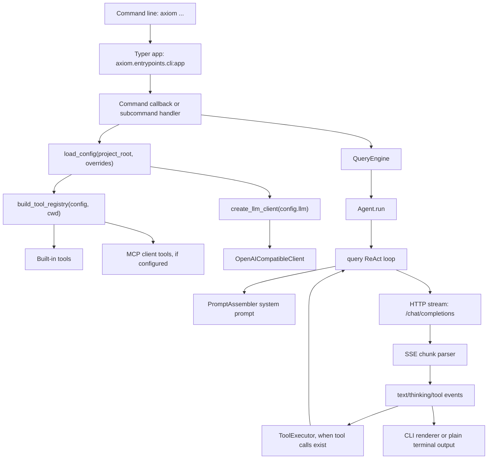

# Current Architecture

## 1. Project overview

Axiom Agent Runtime is a terminal AI agent CLI implemented as a Python package with a
`src` layout. The installed console command is `axiom`, backed by Typer command
registration. It supports an interactive REPL, a one-shot prompt mode, OpenAI
compatible streaming chat completions, function-style tool calling, local
workspace tools, MCP client/server integration, layered memory foundation, snapshots, planning,
multi-agent orchestration, and a lightweight Runtime API.

Core runtime choices:

- Language: Python 3.11 or newer.
- Package manager: uv.
- Build backend: hatchling.
- CLI framework: Typer.
- Terminal UI: Rich and prompt-toolkit.
- HTTP client: httpx.
- MCP integration: the official `mcp` Python SDK.
- Durable Runtime persistence: SQLite by default for local/single-node use, with an optional
  PostgreSQL shared-store backend (`psycopg` + bounded pool) for cross-process durable truth.
  SQLite is locally verified, and the PostgreSQL contract and concurrency suite has passed
  against a real local PostgreSQL 15.12 instance. Ordinary CI does not yet provision PostgreSQL.
- Distributed Run ownership on PostgreSQL: durable runnable metadata, atomic short-transaction
  claims, database-time leases, heartbeat renewal, per-Run fencing generations, expired-lease
  takeover, and ownership-fenced Checkpoint, ToolExecution, and budget writes. SQLite remains the
  local/single-node backend and rejects distributed Worker mode.

The default LLM provider is `deepseek`, the default model is
`deepseek-v4-flash`, and the default provider base URL is
`https://api.deepseek.com/v1`. Requests are sent to the OpenAI-compatible
`/chat/completions` endpoint.

## 2. Architecture diagram



## 3. Module responsibilities

### CLI entrypoints

- `pyproject.toml`
  - Defines the console script:
    `axiom = "axiom.entrypoints.cli:app"`.
- `src/axiom/__main__.py`
  - Supports `python -m axiom` by importing and invoking the same Typer app.
- `src/axiom/entrypoints/cli.py`
  - Owns the Typer app, top-level callback, command registration, one-shot
    prompt execution, `doctor`, Runtime API serving, and MCP management
    subcommands.
- `src/axiom/entrypoints/repl.py`
  - Owns interactive prompt-toolkit session setup, slash commands, Rich
    rendering, approval prompts, and REPL command dispatch.

### Configuration

- `src/axiom/config.py`
  - Defines config dataclasses such as `LlmConfig`, `AxiomConfig`,
    `ToolsConfig`, `DependencyConfig`, `McpConfig`, `MemoryConfig`, and `PolicyConfig`.
  - `load_config()` merges defaults, user config, project config, project env
    file values, CLI overrides, and process environment variables.
  - `_apply_env()` maps public environment variable names into config fields.
  - `config_to_public_dict()` masks API key values before display.

### LLM

- `src/axiom/llm/base.py`
  - Defines the `LlmClient` protocol. The required method is `chat()`, which
    returns an async stream of normalized event dictionaries.
- `src/axiom/llm/factory.py`
  - `create_llm_client()` selects an LLM client based on `LlmConfig.provider`.
  - Contains default provider base URLs and known model context windows.
- `src/axiom/llm/openai_compatible.py`
  - Implements `OpenAICompatibleClient`.
  - Formats messages and tool definitions into an OpenAI-compatible payload.
  - Streams HTTP responses with httpx and parses SSE chunks into internal
    events such as `text_delta`, `thinking_delta`, `tool_call_delta`, `usage`,
    and `message_end`.

### Agent and request lifecycle

- `src/axiom/agent/query_engine.py`
  - Provides the high-level `QueryEngine` facade used by CLI, SDK, and Runtime
    API.
  - Builds the system prompt once for the engine and exposes ReAct, plan, and
    team execution modes.
- `src/axiom/agent/agent.py`
  - Wraps one ReAct run with pre-turn and post-turn snapshots.
  - Stores in-process conversation history after a completed turn.
- `src/axiom/agent/query.py`
  - Implements the core ReAct loop.
  - Creates the user message, passes messages/tools/system prompt to the LLM,
    accumulates assistant text, merges streaming tool-call deltas, executes
    tools, appends tool results, and repeats until the model finishes or the
    max turn limit is reached.
- `src/axiom/agent/plan_execute.py`
  - Provides the Plan-and-Execute compatibility facade. The planner creates a
    versioned DAG; `PlanExecuteStrategy` schedules tool-capable Tasks as bounded parallel durable
    React Child Runs and performs planning, joins, replan barriers, and finalize as Parent
    transitions inside `DurableAgentRuntime`.
- `src/axiom/agent/orchestrator.py`
  - Provides the Multi-Agent compatibility facade over `MultiAgentExecutionStrategy`.
  - Planner and Reviewer remain serialized Parent steps; independent tool-capable Workers run as
    bounded parallel durable React Child Runs.

### Prompting

- `src/axiom/prompt/assembler.py`
  - Builds the system prompt from runtime context, working directory, model,
    provider, available tool names, project memory files, typed long-term memory, and
    the skill index.

### Tools

- `src/axiom/tools/base.py`
  - Defines `Tool`, `ToolContext`, `ToolResult`, and JSON schema helpers.
- `src/axiom/tools/registry.py`
  - Stores tools by name and exports OpenAI-compatible tool definitions.
- `src/axiom/tools/executor.py`
  - Executes model-requested tool calls.
  - Runs read-only concurrency-safe calls in parallel and state-changing calls
    sequentially.
  - Applies HITL approval rules and audit logging for non-read-only actions.
- `src/axiom/tools/builtins.py`
  - Registers built-in workspace, shell, web, memory, skill, code search, and
    snapshot restore tools.

### Code intelligence

- `src/axiom/rag/code_index.py`
  - Public facade for AST indexing, lexical/vector/hybrid search, symbol
    lookup, call-graph queries, and graph-aware context assembly.
- `src/axiom/rag/context.py`
  - Builds deterministic code context from search seeds, unique symbol
    mentions, definitions, direct references, direct callers/callees, and
    bounded incoming/outgoing call paths.
  - Enforces local character, token-estimate, seed, depth, and item hard limits.
  - Preserves workspace-relative paths, reason labels, graph distance, budget
    usage, and stable ordering for agent consumption.
- `src/axiom/rag/store.py`
  - Persists indexed files, AST chunks, FTS5 rows, embedding profiles, vector
    embeddings, symbol definitions/imports/references, and exact call edges in
    SQLite schema version 6.
- `src/axiom/rag/call_graph.py`
  - Builds the conservative static call graph and implements callers, callees,
    bounded call paths, and recursive component analysis.

### MCP

- `src/axiom/mcp/config.py`
  - Loads MCP server specs from user and project MCP config locations.
  - Can write Chrome DevTools MCP config through the CLI helper.
- `src/axiom/mcp/client.py`
  - Connects to stdio and Streamable HTTP MCP servers.
  - Discovers remote tools and wraps them as local Axiom Agent Runtime tools named
    `mcp__<server-name>__<tool-name>`.
  - Adds virtual resource and prompt tools for each MCP server.
- `src/axiom/mcp/server.py`
  - Exposes Axiom Agent Runtime built-in tools as a small JSON-RPC MCP-like server over
    stdio or local HTTP.

### Memory, skills, snapshots, policy, and runtime

- `src/axiom/memory/manager.py`
  - Backwards-compatible facade for legacy scoped memory commands and tools.
- `src/axiom/memory/store.py`
  - Stores typed memory records in SQLite and migrates legacy memory rows
    additively.
- `src/axiom/memory/service.py`
  - Provides fact/preference, summary, conversation, and tool-result digest
    APIs plus Runtime event to message-history recovery and best-effort
    conversation summarization and fact extraction.
- `src/axiom/memory/context.py`
  - Builds deterministic memory context under character, estimated-token, and
    record budgets, skipping raw conversation covered by active summaries.
- `src/axiom/memory/facts.py`
  - Defines fact candidates, the extractor protocol, deterministic local
    extraction, key normalization, category/scope policy, and privacy
    validation for conservative fact/preference memory.
- `src/axiom/memory/summarizer.py`
  - Defines the map/reduce summarizer protocol, deterministic local summarizer,
    segmentation, summary policy, and compression metrics.
- `src/axiom/skill/registry.py`
  - Loads built-in, user, and project `SKILL.md` files and tracks disabled
    skills.
- `src/axiom/snapshot/service.py`
  - Creates and restores pre-turn/post-turn workspace snapshots.
- `src/axiom/policy/path_guard.py`
  - Restricts file tools to the workspace tree.
- `src/axiom/policy/command_guard.py`
  - Rejects obviously destructive shell commands before approval.
- `src/axiom/policy/audit_log.py`
  - Writes JSONL audit entries with sensitive input fields redacted.
- `src/axiom/runtime/api.py`
  - Provides a local Runtime control-plane API for threads, interaction-compatible `/turns`, hierarchical
    Runs, interrupts, idempotent state transitions, events, and background tasks.
  - Supports explicit `data_dir` injection, ephemeral localhost port binding,
    start/shutdown/context-manager lifecycle, `/health`, fake engine injection
    for no-network tests, and a thread/event repository boundary.
  - Thread events are persisted with monotonic IDs and explicit Run/parent/assignment
    lineage, and can be replayed through stored SSE with `after_id` cursors and an
    optional Run filter. This is replay, not an unlimited live event stream.
  - Restores prior user/assistant messages from persisted thread events before
    each turn and writes bounded typed memory records for conversation messages
    and tool-result digests.
  - Runs best-effort summary checkpointing after completed turns when the
    configured deterministic threshold is met. Summary failures do not fail the
    completed Runtime turn.
  - Runs best-effort fact/preference extraction after completed turns. Extracted
    facts are derived state and never replace raw Runtime events.
- `src/axiom/runtime/models.py`
  - Defines `RunState` as the central versioned durable execution state, with `Checkpoint` retained
    as a compatibility name, plus Run statuses, interrupts, errors, and ToolExecution records.
- `src/axiom/runtime/checkpoints.py`
  - Defines the RuntimeStore and `load_run_state`/`advance_run_state` facade plus
    Memory/SQLite implementations. SQLite appends Run-state checkpoint sequences and uses
    optimistic sequence checks to reject stale workers.
- `src/axiom/runtime/steps.py`
  - Defines the in-memory `StepContext`, `StepResult`, the small `NextAction` vocabulary, and the
    deterministic `CompletionPolicy` that combines structured Runtime evidence into a final
    continuation. These types are execution contracts only and have no repository or serialized form.
- `src/axiom/runtime/events.py`
  - Defines the thread/event repository contract, event envelope, and backward-compatible
    SQLite event implementation with monotonic replay IDs.
- `src/axiom/runtime/storage.py`
  - Selects one coherent durable backend bundle for Run/Checkpoint, ToolExecution, budget
    ledger, Event, and control-idempotency truth. SQLite remains the default.
- `src/axiom/runtime/postgres.py`
  - Implements the optional shared PostgreSQL backend with a bounded synchronous connection
    pool. Existing Runtime async methods keep using bounded thread offload rather than forcing
    an async database rewrite.
  - Stores a current `runs` head plus append-only `checkpoints`. Head advancement is one
    `UPDATE ... WHERE run_id = ... AND current_sequence = expected RETURNING ...`; the matching
    history insert commits in the same short transaction. Initial creation uses
    `INSERT ... ON CONFLICT DO NOTHING RETURNING ...`.
  - Uses `JSONB` for domain payloads, `TIMESTAMPTZ` for persistent deadlines/timestamps,
    identity-backed `BIGINT` Event IDs, and database uniqueness for `ToolExecution.invocation_id`.
    Event IDs are monotonic for replay but are intentionally not gapless.
  - Transaction boundaries remain narrow: Run head CAS and its Checkpoint history row are atomic;
    each ToolExecution mutation, budget-ledger CAS, Event append, and control transition is atomic
    within its own repository call. Checkpoints and Events intentionally do not form one giant
    event-sourcing transaction because recovery state and replay history have different roles.
  - Schema metadata rejects an incompatible future Runtime schema. The PostgreSQL driver is an
    optional dependency, and configured credentials are neither returned by public config nor
    copied into Trace/Event metadata.
- `src/axiom/runtime/control_plane.py`
  - Defines the stable public Run projection, allowed control operations, structured
    API errors, child/interrupt summaries, a control-store contract, and restart-safe
    idempotency records.
- `src/axiom/runtime/durable.py`
  - Advances the default ReAct loop across LLM and per-tool durable boundaries,
  persists approval interrupts, resumes after restart, applies deadline-aware bounded retry,
    reuses successful tool invocation records, and registers each executing durable
    Run with the process-local active execution supervisor.
- `src/axiom/runtime/dependency.py`
  - Defines deterministic dependency failure categories, timeout/deadline composition,
    retry safety, exponential full-jitter backoff, and structured retry decisions.
- `src/axiom/runtime/supervisor.py`
  - Tracks process-local Run ownership by thread, event loop, and `asyncio.Task`;
    provides thread-safe lookup, cross-thread cancellation, safe batch results,
    stale-handle cleanup, active inspection, and bounded shutdown drain.
  - Never persists handles. Checkpoints and ToolExecution records remain the
    recovery source of truth.
- `src/axiom/runtime/observability.py`
  - Defines Trace, Span, RunMetrics, stable Run/tool span identities, JSON
    attributes, and latency/token aggregation rules.
- `src/axiom/runtime/observability_store.py`
  - Provides Memory/SQLite observability stores, schema versioning, the
    RunTracer execution hook, and trace/metrics query service.
- `src/axiom/runtime/tasks.py`
  - Stores durable background tasks in SQLite. Production QueryEngine workers execute claimed
    tasks as deterministic durable Runs, so worker-owned event loops participate in active Run
    supervision and shutdown cancellation.
- `src/axiom/evaluation/`
  - Defines JSON datasets, deterministic scorers, the durable Runtime evaluation
    adapter, JSON results, and functional/performance regression comparison.

## 4. CLI execution flow

### Console script flow

Input:

```text
axiom xxx
```

Flow:

```text
command line
-> pyproject console script
-> axiom.entrypoints.cli:app
-> Typer parses options and subcommands
-> callback or command handler
-> configuration, LLM, tools, agent, or service logic
-> terminal output
```

Main entry files and functions:

- `pyproject.toml`
  - Input: installed `axiom` command.
  - Output: imports `axiom.entrypoints.cli:app`.
- `src/axiom/entrypoints/cli.py`
  - `app`: Typer application.
  - `main()`: top-level callback for prompt mode and REPL mode.
  - `doctor()`: local environment/config diagnostic command.
  - `runtime_serve()`: starts the Runtime API.
  - `mcp_serve()`, `mcp_init_chrome()`, `mcp_list()`: MCP commands.
- `src/axiom/entrypoints/repl.py`
  - `start_repl()`: starts interactive mode when no prompt or subcommand is
    provided.

### `axiom --plain -p "hello"` flow

```text
User input
-> Typer callback main(prompt="hello", plain=True)
-> root cwd resolution
-> CLI override dict for render mode/model/provider
-> load_config(project_root=root, overrides=overrides)
-> _run_prompt(prompt, cwd, config)
-> API key presence check
-> build_tool_registry(config, cwd)
-> create_llm_client(config.llm)
-> QueryEngine(...)
-> QueryEngine.ask_complete_async(prompt)
-> Agent.run(prompt)
-> SnapshotService.create("pre-turn")
-> query(...)
-> llm_client.chat(messages, tools, system_prompt)
-> HTTP stream to provider
-> parse SSE chunks
-> collect text_delta events
-> execute tool calls if model requests tools
-> final done event
-> SnapshotService.create("post-turn")
-> return QueryResult
-> typer.echo(result.text)
```

Inputs and outputs:

- CLI input: user-provided options and prompt text.
- Config input: defaults, config files, project env file values, CLI overrides,
  and process environment values.
- LLM input: `messages`, OpenAI-compatible `tools`, and `system_prompt`.
- LLM output: streamed SSE chunks.
- Internal normalized output: event dictionaries.
- CLI output: final text printed to stdout in plain mode.

## 5. LLM request flow

Data structures:

- `LlmConfig`
  - Provider, model, API key presence, base URL, max tokens, temperature, and
    timeout.
- `Message`
  - Role, content, optional name, optional tool call id, and assistant tool
    calls.
- `QueryResult`
  - Final text, total token count, and total turn count.

Request construction:

1. `PromptAssembler.build()` creates the system prompt.
2. `ToolRegistry.definitions()` exports tool schemas.
3. `query()` builds a `Message(role="user", content=...)`.
4. `OpenAICompatibleClient.chat()` builds the payload:
   - `model`
   - formatted `messages`
   - `stream: true`
   - `max_tokens`
   - `temperature`
   - optional `tools`
   - optional `tool_choice: auto`
5. The client posts to:
   `base_url.rstrip("/") + "/chat/completions"`.

Response parsing:

1. `_iter_sse()` extracts `data:` events from the HTTP response stream.
2. `_parse_chunk()` maps provider chunks into internal events.
3. `query()` accumulates text, tool call deltas, stop reason, and usage.
4. If tool calls exist, `ToolExecutor.execute_all()` runs them and appends tool
   results as `role="tool"` messages.
5. The loop repeats until the model stops without tool calls or max turns are
   reached.

## 6. Configuration system

Configuration sources:

1. Built-in dataclass defaults.
2. User config file at `~/.axiom/config.json`.
3. Project config file at `.axiom/config.json`.
4. Project env file at `.env`.
5. CLI overrides from options such as `--provider`, `--model`, and `--plain`.
6. Current process environment variables.

Effective precedence:

```text
defaults
-> user config
-> project config
-> project env file
-> CLI overrides
-> process environment
```

Configuration files may contain local private values. This document only records
the supported locations and precedence. It does not include credential values.

Relevant environment variable names:

- `AXIOM_API_KEY`
- `AXIOM_PROVIDER`
- `AXIOM_MODEL`
- `AXIOM_BASE_URL`
- `AXIOM_MAX_TOKENS`
- `AXIOM_TEMPERATURE`
- `AXIOM_RENDER_MODE`
- `AXIOM_RENDERER`
- `AXIOM_TUI`
- `AXIOM_MCP`
- `AXIOM_SKILL`
- `AXIOM_MEMORY`
- `AXIOM_HITL`
- Provider-specific API key variables are mapped by provider name.

## 7. Extension points

### Adding an OpenAI-compatible provider

If the provider follows the OpenAI chat completions API, add or adjust provider
handling in `src/axiom/llm/factory.py`:

- Add a provider base URL to `PROVIDER_BASE_URLS`, or add a provider-specific
  branch in `create_llm_client()`.
- Add context window metadata if needed.
- Add provider-specific API key mapping in `src/axiom/config.py`.
- Optionally document the provider in README or config docs.

### Adding OpenAI

OpenAI is already routed through the `openai`, `openai-compatible`, and
`compatible` provider branch in `create_llm_client()`. A production-ready
addition would mainly document model names, base URL behavior, and environment
variable expectations.

### Adding Claude

Claude is not OpenAI-compatible by default. A direct provider would likely need:

- A new client implementation under `src/axiom/llm/`.
- A common event stream contract matching `LlmClient.chat()`.
- Factory routing in `create_llm_client()`.
- Message and tool schema translation between Axiom Agent Runtime's internal structures and
  Claude's API.
- Provider-specific configuration mapping.

### Adding Ollama or another local model

If using an OpenAI-compatible local endpoint, existing
`openai-compatible` support can work with `AXIOM_BASE_URL` and `AXIOM_MODEL`.
If using a non-compatible endpoint, add a new `LlmClient` implementation and
factory route.

### Adding tools

Built-in tools are added in `src/axiom/tools/builtins.py`. Each tool needs:

- Name.
- Description.
- JSON schema parameters.
- Required keys.
- Async handler.
- Read-only/concurrency/approval metadata.

Tool execution behavior is centralized in `ToolExecutor`.

### Adding MCP support

MCP client expansion points:

- `src/axiom/mcp/config.py` for config schema and server spec loading.
- `src/axiom/mcp/client.py` for transports, discovery, and wrapper behavior.
- `src/axiom/bootstrap.py` for registration into the active tool registry.

MCP server expansion points:

- `src/axiom/mcp/server.py` for JSON-RPC methods and exposed tool behavior.

## 8. Live context management

Live context management protects every model invocation, including an unfinished ReAct loop. It
is a projection layer, not a persistence or memory replacement:

```text
Durable State
     ↓
ContextBuilder (semantic selection / assembly)
     ↓
ContextBudget (token-window enforcement)
     ↓
Optional Compaction
     ↓
LLM Request
```

The three layers remain intentionally distinct:

- **Durable State** is the append-only Runtime event history, versioned Checkpoint sequence, full
  ToolExecution records, Run lineage, and trace/audit evidence. These records support recovery and
  investigation and are never deleted by model-context compaction.
- **Conversation / Memory** contains derived typed conversation records, active map/reduce
  summaries with source event ranges, facts/preferences, and bounded tool-result digests. A Memory
  Summary improves later context but is not the durable source of truth.
- **Model Context** is the transient system prompt, tool schemas, and message projection sent for
  one LLM request. A Checkpoint is not Context: it stores resumable raw execution state, while the
  projection can replace an eligible old prefix with one derived summary without rewriting that
  Checkpoint.

### Budget and configuration

`ContextBuilder` decides which existing Runtime messages, valid reusable summary, Tool protocol
evidence, strategy-specific prompt, and recovery hint are desired for a model call. It does not
trim for token pressure and returns only an ephemeral `ContextBuildResult`. `ContextBudget.fit()`
then estimates and fits that desired context within one request's input window. `ContextManager`
remains the compatibility facade composing both stages. ReAct and durable multi-agent role calls
use the split explicitly; planning and lightweight paths use the same split through that facade.

The deterministic estimator counts the system prompt, tool definitions, message content,
tool-call metadata, and per-message overhead. It implements the pluggable `TokenEstimator`
protocol; a provider tokenizer can replace it later without changing compaction policy.

Default policy:

- model context window: explicit `context.model_context_window`, then trusted
  `LlmClient.max_context_window`, then a deterministic 64,000-token unknown-model fallback;
- reserved output: explicit `context.reserved_output_tokens`, otherwise the configured LLM output
  maximum bounded to one quarter of the input window;
- high watermark: `0.80` of usable input;
- target after compaction: `0.60` of usable input;
- recent raw reserve: 6 messages;
- hard input limit: usable input (`model_context_window - reserved_output_tokens`);
- bounded historical tool-result projection: 2,000 characters.

Project/user JSON config follows the repository's existing configuration precedence, with CLI and
environment overrides applied afterward. `AXIOM_CONTEXT_WINDOW`,
`AXIOM_CONTEXT_RESERVED_OUTPUT_TOKENS`, `AXIOM_CONTEXT_HIGH_WATERMARK`,
`AXIOM_CONTEXT_TARGET_RATIO`, `AXIOM_CONTEXT_RECENT_MESSAGES`,
`AXIOM_CONTEXT_HARD_INPUT_LIMIT`, and `AXIOM_CONTEXT_MAX_TOOL_RESULT_CHARS` are supported. Invalid
ratios, negative reserves, or hard limits outside usable input are rejected.

The trigger is estimated input usage rather than Agent iteration count:

```text
usable_input = model_context_window - reserved_output_tokens
compact when estimated_input >= usable_input * high_watermark_ratio
target = usable_input * target_after_compaction_ratio
```

### Compaction and pinned context

The builder validates a prior live summary against its covered-prefix fingerprint without mutating
RunState. The budget stage reuses that summary and, when the
projection reaches the high watermark, it selects only the oldest eligible prefix, segments it for
the existing map stage, calls the existing `ConversationSummarizer` map/reduce protocol, and emits
one structured summary containing objective, constraints, decisions, completed work, open work,
modified files, important evidence, and known failures. New compactions summarize only the raw
suffix after the prior coverage cursor, so summaries do not accumulate as repeated system
messages.

Pinned/non-evictable context includes the current user objective, current constraints and task
state, the recent raw reserve, incomplete or pending tool protocol state, and plan/worker
continuation information supplied in the current objective/system prompt. Assistant tool calls and
their matching tool results are selected atomically, so compaction never leaves only one side of a
provider-required tool exchange.

An oversized historical tool result may be replaced only in the model-facing copy. The projection
includes the tool name, success/error state, original character size, `truncated: true`, and bounded
head/tail content. The full ToolExecution result remains durable. Current/recent tool interactions
remain pinned; if they alone cannot fit, the request fails rather than silently discarding them.

After compaction the budget stage re-estimates the complete request. If the configured summarizer
fails, it retains the prior derived summary and durable history, then uses the deterministic local
summarizer for eligible old context. If pinned context still exceeds the hard input limit, the Run
fails before provider invocation with `CONTEXT_BUDGET_EXCEEDED`. No known-oversized request is sent,
and the prior Checkpoint remains recoverable.

Existing LLM spans record `context.estimated_tokens_before`,
`context.estimated_tokens_after`, `context.compaction_triggered`,
`context.compaction_count`, `context.compression_ratio`, `context.evicted_messages`,
`context.preserved_messages`, `context.tool_results_projected`, and
`context.trigger_reason`. These attributes contain counts and decisions, never full tool payloads.
No complete prompt or `ContextBuildResult` is persisted: after a crash the Runtime rebuilds it from
RunState, history/Memory, existing summary state, and ToolExecution evidence. Memory stores reusable
information; retrieval produces candidate evidence; ContextBuilder decides whether that evidence
joins this call; ContextBudget only enforces the window. ContextBudget is per request, while
RunBudget accounts cumulative calls, actual provider-reported tokens, time, and cost across a Run.

### Interview-oriented explanation

1. **How do you prevent a long Agent loop from exhausting context?** Before every model call,
   estimate the complete request, compact an eligible old prefix with the existing map/reduce
   summarizer, preserve pinned state, and re-estimate before sending.
2. **Why token budget rather than fixed loop count?** One tool result can be larger than many normal
   turns, while dozens of short turns may still fit. Estimated request size tracks the actual risk.
3. **What cannot be compacted?** The current objective and constraints, recent messages, unresolved
   execution state, pending approvals/tool work, atomic tool protocol exchanges, and state required
   to continue a plan or Child Run.
4. **What if compaction fails?** Durable history remains unchanged; deterministic local compaction
   is attempted for eligible old context. If pinned context still exceeds the hard limit, the Run
   returns `CONTEXT_BUDGET_EXCEEDED` without calling the provider.
5. **How is durable state different from model context?** Durable state is the complete recovery and
   audit record. Model context is a disposable, budgeted view derived from it for one request.

## 9. Completion verification

`RunStatus.COMPLETED` is no longer the only available completion claim. A model or execution
strategy first proposes termination; when the Run has a `CompletionContract`, the deterministic
`CompletionVerifier` checks the proposal against configured evidence before terminal success:

```text
strategy/model proposes completion
        ↓
CompletionVerifier
        ↓ evidence
CompletionPolicy
        ├── no contract / VERIFIED / NOT_APPLICABLE → COMPLETE
        ├── first allowed NOT_VERIFIED → CONTINUE with corrective feedback
        └── repeated NOT_VERIFIED / ERROR → FAIL
        ↓
Runtime applies the RunState transition through normal CAS/fencing
```

The v1 check set is deliberately small: candidate Run status, required/forbidden Tool use,
successful ToolExecution result evidence, output contains/exact match, workspace artifact
existence, and durable Plan task plus Child Run completion. A command/test check is represented by
successful evidence from the normal Tool runtime; the verifier never launches a hidden subprocess.

ReAct receives at most one structured verification feedback turn by default. That continuation is
an ordinary LLM step, so existing step/model/token/cost/wall-time budgets and Progress rules remain
authoritative. A repeated failure is terminal `FAILED` with `COMPLETION_NOT_VERIFIED`. Plan and
Multi-Agent terminal proposals are checked once because injecting another planning loop would be a
larger architecture change.

The contract, latest result, and attempt count are additive Checkpoint fields and therefore survive
restart without changing the checkpoint schema version. Verification spans/events expose status,
attempt count, check count, and failed check IDs; they do not log Tool arguments. `RunMetrics` and
Evaluation results expose `completion_verified`, `verification_status`, attempts, and failed check
IDs. Open-ended Runs without deterministic criteria remain `NOT_APPLICABLE`, not falsely verified.

`CompletionPolicy` is a pure Runtime decision layer, not another verifier or state machine. It
consumes only the proposed generic action, Run control status, progress decision, verification
status/attempt allowance, and hard-budget/fatal-error signals. Durable `CANCELLED` or `INTERRUPTED`
control outranks policy and yields no ordinary action; hard limits and terminal no-progress yield
`FAIL`; verified or not-applicable completion yields `COMPLETE`; strategy waiting remains `WAIT`.
Specific failure truth such as `NO_PROGRESS`, `COMPLETION_NOT_VERIFIED`, or a budget error stays in
RunState error metadata. The decision itself is ephemeral and adds no table or schema migration.

## 10. Evaluation feedback and regression gate

Evaluation keeps Runtime self-correction, badcase feedback, and regression evaluation as separate
layers:

```text
Runtime / Evaluation → Failure → BadCase Collector → Deterministic Taxonomy
        → Human Review → Regression Dataset → Repeated Trials
        → Baseline vs Candidate → Regression Gate
```

- **Runtime self-correction** is part of the live reasoning loop. A Tool error can be returned to
  the current LLM and the same Run can recover.
- **Badcase collection** occurs after a completed or terminal execution. It writes a compact local
  JSON record with stable Run/Thread/Turn/Trace references and never feeds the record into the
  current conversation.
- **Regression evaluation** creates fresh durable Runs from explicitly promoted `EvaluationCase`
  records. It does not resume or mutate the source failure.

`BadCaseCollector` converts failed evaluation trials or an explicitly selected terminal `run_id`.
It combines scorer failures, Checkpoint status/error, ToolExecution state, and safe Trace/Span
attributes into a multi-label taxonomy. `BadCaseStore` provides atomic, duplicate-safe local JSON
persistence and review states `PENDING`, `APPROVED`, `IGNORED`, and `PROMOTED`. Only human-approved
records may be promoted. Dataset persistence happens before the store is marked promoted, making
retries idempotent without silently overwriting unrelated cases. Missing deterministic
expected/scorer evidence is a structured promotion failure rather than an invented oracle.

Evaluation result schema v3 retains every trial, preserves v1/v2 loading, and adds per-case `trial_success_rate`,
success/failure counts, and average/minimum/maximum tokens, steps, and latency. `--trials 1` is the
backward-compatible default. Each trial receives independent Run, Thread, Turn, Trace, Checkpoint,
and ToolExecution state.

Baseline comparison distinguishes a hard 100%-to-0% functional regression, an intermediate
stochastic quality change, performance drift, and improvement. The regression gate fails on hard
functional regressions, new required failures, per-case success-rate drops beyond tolerance, or
explicit token/step/latency hard thresholds. Token/latency/step comparison thresholds remain
warning-only by default because provider behavior is noisy, especially latency.

Attribution uses the explicit package/build version and safe deterministic SHA-256 fingerprints of
whitelisted model configuration, the assembled prompt, Tool schemas, permission policy, Context
policy, and dataset version. It stores model provider/name for readability. API keys, credentials,
base URLs, Tool arguments, and raw payloads are excluded from both reports and fingerprints. Git is
not a Runtime dependency.

### Interview-oriented explanation

1. **How is a nondeterministic Agent evaluated?** Independent trials preserve every outcome while
   per-case success rates and resource aggregates express observed variability.
2. **How does an LLM-visible error differ from a Badcase?** The error supports recovery inside one
   Run; the Badcase is an after-the-fact review artifact and never enters that Run's context.
3. **How does failure become a regression test?** Deterministic collection and classification are
   followed by human approval and explicit, provenance-preserving dataset promotion.
4. **Why human review?** Provider outages, bad tests, environment failures, expected randomness,
   and product defects require different action, and only a reviewer can validate the oracle.
5. **How is the responsible change identified?** Compare runtime, model/configuration, prompt,
   Tool-schema, policy, Context-policy, and dataset fingerprints, then resolve durable Run/Trace
   references for evidence.
6. **What fails the gate?** Hard functional/new-required failures, excessive success-rate drops,
   and explicitly enabled resource limits. Default performance drift warns.

Context quality has a separate offline deterministic harness. The fixed 10-case
`context-retention-v1` dataset declares required objective, constraints, open tasks, decisions,
artifact references, critical evidence, and pending protocol state. Reports pair token reduction
and compression ratio with per-item retention and protocol integrity. Baseline/candidate comparison
makes any retention or protocol decrease a hard regression; worse compression is only a warning,
so stronger compression cannot hide lost required state. An optional deterministic outcome probe
compares the same synthetic task over full and compressed context. Missing stage metadata is
reported conservatively as `lost_after_compaction`.

## 11. Run Budget and Cost Accounting

Run budgeting is a durable execution guard, separate from request Context budgeting and from
post-run metrics:

```text
                     Run Budget
                         |
        +----------------+----------------+
        |                |                |
   Model Calls        Tool Calls        Steps
        |
        v
 Input / Output Tokens
        |
        v
 Model Pricing
        |
        v
     Cost Ledger
```

`RunBudgetPolicy` defines optional hard limits for steps, model calls, actual Tool invocations,
input/output/total tokens, total Run lifetime, and model cost. `None` is unbounded; defaults are
therefore backward compatible. `soft_limit_ratio` defaults to `0.8`: crossing it annotates the Run
but neither rewrites prompts nor changes strategy. Invalid non-positive limits and ratios outside
`(0, 1)` are rejected.

The durable ReAct path checks a step before each durable decision/execution transition, reserves a
model-call unit immediately before each provider request, and consumes a Tool-call unit immediately
before Tool code executes. Plan/replan and Multi-Agent role provider requests use the same manager;
Plan and Multi-Agent worker Tasks share it with their durable Child Runs. Runtime-owned retries are
new operations and consume new call units. A successful persisted ToolExecution reused on resume is
resolved before the Tool preflight and is therefore not charged twice.

Context estimation is used conservatively before an LLM call. Provider-reported input, output,
cached-input, and reasoning usage replaces the reservation during reconciliation and is the
authoritative token/cost record. Cached tokens are a subset of input tokens: regular input is
`input - cached`, so cached input is never double-counted. Partial streamed usage is retained;
failed requests without usage consume a model-call unit but invent no tokens. An unknowable
post-call token/cost overshoot is persisted and terminates the Run; the next operation is never
started.

```text
Parent Run Budget
      |
      +-- Child Run A
      +-- Child Run B
      +-- Child Run C

All local usage --> one Parent aggregate ledger
```

The root Run owns a versioned ledger in the Runtime store. Every descendant has local usage and
the same atomic ledger also computes aggregate usage. CAS updates plus a process-local lock prevent
concurrent children from both reserving the same final call/token/cost allowance. Model-call units
are exact reservations; input tokens/cost use request estimates followed by actual reconciliation.
Checkpoint stores the stable owner and policy, while the ledger persists counters and idempotent
operation identities. Resume reloads both, so cancellation, interruption, approval waiting, or
restart never refunds or resets usage. Wall time means total lifetime including approval waits and
downtime: persisted `created_at` establishes the restart baseline and a process-local monotonic
anchor protects live enforcement from wall-clock adjustments.

Pricing is explicit local configuration under `run_budget.model_pricing`, keyed by
`provider/model`, with input/output and optional cached-input USD-per-million rates. No network
lookup or guessed built-in price is used. Decimal arithmetic is retained in the ledger. Unknown
pricing produces `cost_known=false` and `cost_usd=null`, never `$0`; configuring `max_cost_usd`
without matching pricing fails Runtime construction visibly.

Hard failures use structured codes (`STEP_BUDGET_EXCEEDED`, `MODEL_CALL_BUDGET_EXCEEDED`,
`TOOL_CALL_BUDGET_EXCEEDED`, input/output/total token variants,
`WALL_TIME_BUDGET_EXCEEDED`, and `COST_BUDGET_EXCEEDED`) with dimension, limit, used, remaining,
and Run ID. Root span attributes and `RunMetrics` expose policy, local usage, descendant aggregate,
remaining values, cost-known state, soft/hard pressure, and the exceeded dimension.

Configuration precedence is the existing default/config-file/environment order. Environment
overrides use `AXIOM_RUN_MAX_*` and `AXIOM_RUN_BUDGET_SOFT_LIMIT`; pricing remains structured local
configuration so secrets are neither required nor fingerprinted.

### Budget interview answers

1. **How is unlimited work prevented?** Every resource-consuming durable boundary atomically
   checks and records the Run/tree ledger before proceeding.
2. **Are overruns detected only afterward?** Calls, Tools, steps, and existing consumption are
   preflighted. Unknown provider output can only be reconciled afterward and then fails the Run.
3. **Estimated versus actual tokens?** Estimates reserve scarce input capacity; provider usage is
   authoritative accounting and billing evidence.
4. **How do Multi-Agent children share budget?** Local child counters roll into one root-owned
   aggregate ledger; children do not receive independent copies of the parent allowance.
5. **How are worker races avoided?** Ledger changes use atomic compare-and-swap retries, with a
   local async lock reducing contention.
6. **What if pricing is unknown?** Tokens still work, cost stays explicitly unknown, and a hard
   cost policy is rejected because it cannot be enforced honestly.
7. **Why is fewer tokens not automatically better?** Efficiency that lowers task success can be
   a product regression.
8. **Why Cost per Success?** It divides total fully known trial cost by successful outcomes, making
   quality loss visible in an efficiency metric.
9. **How are retries charged?** Each real provider request and each repeated Tool execution is a
   new unit; a restored successful Tool result is not.
10. **How does budget survive resume?** Checkpoints retain ownership/policy and the versioned
    Runtime ledger retains counters, reservations, operation IDs, cost, and original lifetime.

### Dependency timeout, deadline, and retry policy

Timeout and deadline are separate controls. `LlmConfig.timeout` and `Tool.timeout` bound one
attempt. Before each Runtime-visible LLM or Tool attempt, the durable Runtime obtains the remaining
local/root wall-time budget and uses:

```text
effective attempt timeout = min(configured attempt timeout, remaining Run lifetime)
```

A Child Run therefore cannot extend its Parent/root wall deadline. A retry is rejected before
sleeping when its delay cannot fit in the remaining lifetime. If the wall-time budget is already
exhausted, the existing `WALL_TIME_BUDGET_EXCEEDED` control remains authoritative.

`RetryClassifier` distinguishes timeout, rate limit, selected transient 5xx, connection,
validation, authentication, policy, permanent, and unknown failures. Only the first four transient
categories are retry candidates. Model inference is retry-safe, while Tool retry safety comes from
explicit metadata: read-only is safe, an explicitly idempotent operation is safe, and an arbitrary
write is unsafe. An idempotency-key parameter is sufficient only when the invocation actually
receives the Runtime's stable invocation ID. A timeout does not prove that an external side effect
did not happen.

Backoff uses bounded exponential full jitter. For failure number `n`, the upper bound is
`min(max_delay, base_delay * 2^(n-1))`; the actual delay is sampled from zero to that upper bound.
A provider `Retry-After` value is respected when the surfaced exception exposes it. Random and
sleep sources are injectable for deterministic tests.

Tool attempts retain one logical `invocation_id`. `ToolExecutionRecord` persists attempt count,
last failure category/error code, cumulative backoff, UTC pending-retry deadline, suppression
reason, and an explicit `NONE / RETRY_PENDING / RETRY_SUPPRESSED / RETRY_EXHAUSTED` state. An
ambiguous unsafe transport failure is `UNKNOWN`, not falsely asserted as failed. A restart
therefore does not reset the allowance or erase a conservative stop, and a persisted successful result is
still reused without execution or budget charge. Each real model/Tool attempt consumes the normal
model-call/Tool-call ledger unit. Partial provider usage is retained when reported; unknown usage is
not invented.

Trace attributes reuse LLM/Tool spans (`dependency.retry_attempt`, `retry_count`,
`failure_category`, `timeout_ms`, `backoff_ms`, `retryable`, and exhaustion/suppression flags).
`RunMetrics` aggregates retried model and Tool calls, dependency timeouts, rate limits, retry
exhaustion, and backoff time. Retry metadata does not contain raw Tool arguments.

This is deliberately per-operation resilience. It does not add a shared circuit breaker, global
rate limiter, queue, backpressure, or cross-Run dependency-health state. HTTP/MCP SDK internals may
also have transport behavior that the Runtime cannot observe; duplicate external effects remain
ambiguous without downstream idempotency or operation-status support.

## 12. No-Progress / Loop Degeneration Detection

`max_steps` bounds how long a Run may work; it cannot tell whether that work remains useful. The
durable Runtime records a bounded deterministic progress projection at Tool and orchestration
boundaries:

```text
Agent Loop
   -> Progress Observation
   -> Progress Detector
        |-- progress -> continue
        `-- stagnation -> bounded recovery
                            |-- progress -> continue
                            `-- repeated -> NO_PROGRESS
```

`ProgressPolicy` has conservative thresholds for identical actions, equivalent errors, complete
short cycles (length 2-4), unchanged stable state, and recovery attempts. Action fingerprints hash
the Tool name and canonical JSON arguments. Error fingerprints hash type, Tool/category, and a
bounded message after removing timestamps, UUIDs, request IDs, addresses, and other volatile
values. State fingerprints use durable facts such as completed Plan tasks, completed Workers,
structured review decisions, and bounded successful Tool evidence. The detector neither scans the
whole repository nor judges free-form reasoning.

New evidence, Plan/Worker completion, an approved review, or another changed stable state resets
stagnation. Different prose alone does not. Read-only exploration is allowed by conservative
defaults, and restored successful ToolExecution records are not counted as new actions.

The first detection adds a marked Runtime-derived recovery instruction to the next model-facing
Context projection; it does not alter raw conversation history. Recovery consumes ordinary
step/model/token/cost budget. Progress resets recovery state. Repeated detection after the recovery
limit fails with `NO_PROGRESS` and safe metadata: detector type, repetition/cycle counts, hashes,
attempts, Run ID, and step. A normal Run-budget failure during recovery remains authoritative.

Policy, bounded fingerprints, processed operation IDs, counters, and recovery state are persisted
in Checkpoint. Resume therefore continues near the prior threshold without double-counting an
operation. Child Runs have independent detectors. Their failures flow through existing
Plan/Multi-Agent replan, dependency, review, and sibling semantics; Parent observations cover
structured orchestration transitions without merging every Child action. Context compaction cannot
erase detector state.

Defaults are enabled with 4 identical actions, 3 identical errors, 3 complete cycle repetitions,
8 stagnant eligible steps, 1 recovery attempt, and 32 retained entries. `AXIOM_PROGRESS_*`
environment overrides follow normal config precedence; inconsistent bounds are rejected.

### No-progress interview answers

1. **Why is `max_iterations` insufficient?** It caps quantity but cannot detect repeated useless
   work before the cap.
2. **How is no progress detected?** Canonical actions, normalized errors, complete short cycles,
   and unchanged durable state are checked against explicit thresholds.
3. **How are legitimate retries distinguished?** Thresholds permit retries and changed evidence
   resets counters; restored Tool results do not add observations.
4. **Can A-B-A-B be found?** Yes, after multiple complete cycles of length 2-4.
5. **What follows detection?** One bounded recovery signal requests a materially different
   approach; repeated detection ends in `NO_PROGRESS`.
6. **Why not terminate immediately?** Transient failures can recover, while the recovery cap keeps
   that attempt bounded.
7. **How does restart work?** Checkpoint retains bounded histories, operation IDs, counters,
   last-progress step, and recovery attempts.
8. **How does Budget interact?** Recovery is charged normally; no-progress may stop earlier, while
   any budget reached during recovery remains authoritative.
9. **How do Multi-Agent children behave?** Each detects locally and its terminal state is reconciled
   by the Parent without directly cancelling unrelated siblings.
10. **Can it false-positive?** Yes; conservative defaults, complete-cycle requirements, evidence
    resets, and recovery-before-termination mitigate that risk.

## 12.1 Distributed Run ownership

Distributed Worker mode keeps execution status separate from scheduling metadata on `runs`:
`runnable`, `owner_worker_id`, `lease_until`, and monotonic `fencing_token` (plus diagnostic claim
and heartbeat timestamps). `claim_next` selects stable `created_at/run_id` order with
`FOR UPDATE SKIP LOCKED`, updates ownership, and commits immediately. The row lock only avoids
claim-selection contention; the finite lease and fence provide long-running authority, so no
database transaction spans LLM or Tool work.

The claimability predicate requires a runnable active execution state (`RUNNING` or the Parent's
inline-child coordination state `WAITING_CHILD`), no active lease, a live wall-time deadline, and
no cancelled durable ancestor. User-intentionally `INTERRUPTED` Runs are not
automatically recovered. Routine heartbeats use PostgreSQL server time and do not append Event rows.
Renewal rejection or database uncertainty fails closed and cancels local execution. A later claim
of an expired runnable Run increments the fence and resumes its latest Checkpoint; no separate
queue broker or state-rewrite scanner is required in v1.

Checkpoint sequence CAS and fencing compose: CAS rejects stale state while fencing rejects a stale
execution owner. Claimed execution also fences ToolExecution and root budget-ledger mutations.
Durable cancel is intentionally independent and authoritative; it can commit while the owner is
dead, makes renewal fail, and makes the Run unclaimable. Current Plan/Multi-Agent schedulers execute
Child Runs inline, so the claimed root Run's ownership authorizes that execution tree rather than
claiming each Child independently. Fencing cannot revoke an already-issued external side effect;
stable invocation identity, downstream idempotency, status lookup, and `UNKNOWN` semantics remain
necessary. `ActiveRunSupervisor` still only manages live Tasks inside one process.

## 12.2 Canonical Runtime domain model

Thread manages conversation scope. Run is the only durable execution/control/ownership unit and
may be a root or independently durable Child Run. `RunState` is its versioned recovery state;
`Checkpoint` and the append-only `checkpoints` table remain backward-compatible persistence/history
terminology, not a separate business aggregate. A Step is an ephemeral execution iteration and has
no table, repository, lease, or state machine. Event is append-only timeline/SSE/audit evidence and
is not replayed to recover a Run. ToolExecution remains separate durable truth because logical Tool
identity, attempts, ambiguous outcomes, and external side effects need stronger semantics.

One Step begins from an authoritative `RunState`. `StepContext` carries Run correlation, the current
control state, strategy, and inherited Run ownership context; the strategy/runtime performs one
existing iteration and returns `StepResult` with a small continuation decision plus lightweight
Tool invocation IDs. The Runtime still owns control checks, budgets, ownership validation, and
RunState CAS. The deterministic `CompletionPolicy` resolves structured verifier, progress, budget,
and strategy evidence into `NextAction`, which remains limited to `CONTINUE`, `COMPLETE`, `WAIT`,
and `FAIL`; cancellation and interrupt remain authoritative Run control states. A Step is not
necessarily one model call, Tool
call, Event, Checkpoint, Turn, plan node, or Child Run.

All three execution strategies now enter the same small Runtime step skeleton. Before constructing
an ordinary `StepContext`, Runtime reconciles ancestor cancellation, requires `RUNNING`, validates
the current Run ownership/fence through refresh, and checks remaining wall-time budget. It then
invokes one strategy-specific iteration and validates the returned Run/index correlation. Only
`CONTINUE` begins another ordinary iteration; `WAIT`, `COMPLETE`, `FAIL`, or authoritative control
state returns to the caller. This prevents Parent `WAITING_CHILD` and HITL states from busy-spinning.
The helper does not charge budgets, increment `step_index`, execute Tools, or persist a second kind
of state: existing successful model/Tool boundaries remain the sole owners of their accounting,
index advancement, ToolExecution truth, and versioned RunState writes.

```text
control / ancestor / ownership / wall-budget preflight
        ↓
StepContext
        ↓
strategy-specific model / Tool / Child-Run work
        ↓
ProgressDetector → CompletionVerifier (completion candidates only)
        ↓
CompletionPolicy → NextAction
        ↓
existing ownership-aware RunState CAS
```

`turn_id` remains correlation and HTTP interaction compatibility metadata. There is no Turn model,
TurnRepository, Turn state machine, or `turns` table, and recovery does not load or replay a Turn.
The canonical recovery path is ownership claim, load RunState, load required ToolExecution evidence,
reconstruct in-memory execution context, and continue. Core idempotency uses run ID, Run sequence
CAS, ownership fence, stable Tool invocation ID and ToolExecution outcome—not Turn or Step identity.

| Concept | Durable? | Authority |
| --- | ---: | --- |
| Thread | yes | conversation scope |
| Turn | compatibility projection only | interaction correlation, not recovery |
| Run | yes | execution, control, lineage, ownership |
| RunState / Checkpoint mechanism | yes | versioned recovery state and CAS history |
| Event | yes | timeline, SSE, audit/debug evidence |
| ToolExecution | yes | logical Tool invocation, attempts, and outcome |
| Step | no | ephemeral execution iteration |
| Trace/Span | observability | metrics and debugging |

## 13. Current limitations

- The only concrete LLM client implementation is OpenAI-compatible streaming
  chat completions. Non-compatible providers need new client adapters.
- The one-shot CLI prompt path does not provide an interactive approval callback,
  so tools requiring approval are denied unless policy/configuration changes
  allow them.
- The MCP server implementation exposes tools/list and tools/call style methods
  but is minimal compared with a full-featured MCP server implementation.
- Project/user configuration can contain secrets; architecture tools and reports
  should treat these files as sensitive and avoid reading their contents unless
  explicitly requested.
- Runtime API durable truth can use local SQLite or shared PostgreSQL. The HTTP server remains
  bound to localhost by default and is not a public deployment, load-tested API, admission
  controller, or fair/priority scheduler. PostgreSQL unavailability fails visibly; it never
  silently falls back to SQLite and splits truth.
- The durable Runtime covers ReAct plus bounded local Plan DAG and Multi-Agent scheduling.
  Plan Tasks and tool-capable Multi-Agent Workers use stable React Child Runs; Parent state is
  checkpointed with stable lineage and CAS-safe terminal reconciliation. There is no distributed
  lock, distributed scheduler, cross-process worker supervisor, or checkpoint compaction yet.
- Active execution supervision and Task cancellation remain process-local. In distributed Worker
  mode, PostgreSQL is the ownership authority: a Worker atomically claims runnable `RUNNING` Runs,
  renews a finite lease, and supplies the current fencing token to authoritative writes. The
  bounded polling claim loop also discovers expired leases and takes them over with a higher
  token. It does not provide cross-process Task signalling; durable cancellation instead prevents
  renewal/reclaim and the local owner converges by failed heartbeat or fenced write.
- Parent cancellation is the durable authority. Cancellation persists the Parent first and then
  best-effort cancels non-terminal descendants. If a crash lands between those steps, explicit
  Child resume/execution preflight walks durable ancestors and reconciles the Child to `CANCELLED`;
  completed Children remain completed. This is targeted reconciliation, not a background scanner.
- Runtime tool records provide best-effort deduplication after a persisted
  success, not exactly-once semantics for arbitrary external side effects.
- Observability is local and unsampled. There is no distributed trace context,
  OpenTelemetry export, external dashboard, retention, or cross-process clock
  correction.
- Runtime thread history recovery, typed memory, Map-Reduce summary checkpoints,
  and conservative scoped fact/preference extraction are implemented locally,
  but semantic memory retrieval, remote summarization/extraction CI, and
  production LLM extraction quality evaluation are not implemented yet.
- Snapshot restore can overwrite workspace files and should be treated as a
  destructive capability.
- Terminal text in some files appears to contain encoding artifacts, which may
  affect display quality but is separate from the request lifecycle.

## 14. Final control precedence and failure matrix

The controls are layered rather than interchangeable. Explicit cancellation is authoritative.
Cancellation of an unsafe in-flight Tool leaves `UNKNOWN` Tool evidence with retry suppression,
because stopping the local Task cannot prove that an external effect did not occur. Hard Run/tree budget checks,
including the wall-time lifetime, stop work before dependency retry policy is considered. Each
dependency attempt is then bounded by the smaller of its configured timeout and the remaining
local/root Run lifetime. A safe transient failure may retry only while both attempt allowance and
outer lifetime remain. Normal progress detection governs completed logical Tool/strategy steps;
completion verification runs only after a strategy proposes termination and any correction returns
to the same budgeted loop. Context hard-limit failure occurs before a provider request.

| Failure | Runtime behavior | Durable evidence | Retry? | Result/control |
| --- | --- | --- | --- | --- |
| LLM timeout | Classify as transient after one bounded attempt | Checkpoint error, Trace/metrics, retry state | Bounded; each provider attempt is charged | Success, deadline, or structured exhaustion |
| LLM 429 / selected 5xx / connection error | Classify from surfaced provider evidence; honor numeric `Retry-After` when available | Checkpoint error and Trace/metrics | Bounded | Success, deadline, or structured exhaustion |
| Read/idempotent Tool timeout | Keep one logical invocation and classify the failed attempt | `ToolExecution` attempts plus Trace/metrics | May retry | Tool result returns to Agent after success/exhaustion |
| Unsafe write Tool timeout | Treat external outcome as ambiguous | `ToolExecution.UNKNOWN` with suppression metadata | No automatic retry | Structured Tool error; recovery requires explicit approval/status/idempotency evidence |
| Run/tree budget exhausted | Preserve the specific budget dimension and metadata | Checkpoint and budget ledger | No | `*_BUDGET_EXCEEDED` remains authoritative |
| Context hard limit exceeded | Fail before the provider request | Checkpoint/Run error and context attributes | No | `CONTEXT_BUDGET_EXCEEDED` |
| Repeated no-progress | Emit one bounded recovery signal, then stop if stagnation continues | Checkpoint progress state and Trace | Not a dependency retry | `NO_PROGRESS` |
| Completion check fails | ReAct may receive one configured corrective turn; orchestration terminal checks are one-shot | Contract/result/attempt in Checkpoint and verification Trace | Only normal budgeted continuation | Verified completion or `COMPLETION_NOT_VERIFIED` |
| Explicit cancel | Persist durable control, then signal the process-local owner; descendant resume reconciles cancelled ancestors | Checkpoint, ToolExecution, and control/Trace events | No | `CANCELLED`; unsafe in-flight Tool evidence may remain `UNKNOWN` |

The retry metrics distinguish one logical model/Tool operation from its actual provider/Tool
attempts. Model-call and Tool-call budget counters count actual attempts; retry counters count only
attempts after the first. A restored `SUCCEEDED` Tool execution is reuse, not another attempt.

## 15. Runtime Feature Freeze

The core Runtime capability set is now frozen. Future work should prioritize interview
preparation, source-code review, real-workload evaluation, bug fixes, and evidence-driven
hardening. New Runtime subsystems should be added only when a concrete requirement demonstrates a
gap. PostgreSQL-backed runnable discovery, Worker claim, lease/heartbeat/fencing, and expired-lease
takeover are implemented. Global Admission Control, backpressure, Run-level retry/DLQ,
fairness/priority scheduling,
shared circuit breakers, and global rate limiting remain explicit future decisions rather than
implied features.

## 16. Final interview mental model

```text
Execution
---------
ReAct / Plan / Multi-Agent
DAG / Child Runs

Durability
----------
Run / versioned RunState / CAS
ToolExecution
interrupt / resume / cancel
Supervisor

Harness Governance
------------------
Tool Policy / HITL
Context Budget / Compaction
Run Budget / Cost
Progress Detection
Dependency Timeout / Safe Retry

Quality Evidence
----------------
Trace / Span
Completion Verification
Context Retention Eval
Repeated Evaluation
Badcase / Regression
Cost per Success
RL Trajectory / Reward / Rollout
```

## 17. Agentic RL bridge

The Runtime feature freeze remains in effect for ordinary Agent functionality. The deliberately
opened RL direction is an adapter over existing evidence, not another execution path:

```text
Run / Checkpoint / ToolExecution / Trace / Verification / Metrics
    -> AgentTrajectory -> RewardPipeline -> RolloutDataset -> external trainer
```

One durable Run maps to one episode. Child Runs remain linked sub-episodes. Checkpoint is durable
environment truth, while an observation is only the projection shown to the model. The bridge
marks compacted projections as lossy, validates tool/action relationships and terminal state,
redacts common credential forms, and stores decomposed reward plus safe provenance fingerprints.
Agent Lightning 1.0.1 compatibility is smoke-tested; the real v1 update used TRL GRPO + LoRA and
produced no held-out success gain (0/30 to 0/30). See
[Agentic RL Bridge v1](agentic-rl.md) for schema, trainer selection, claims, and limitations.

